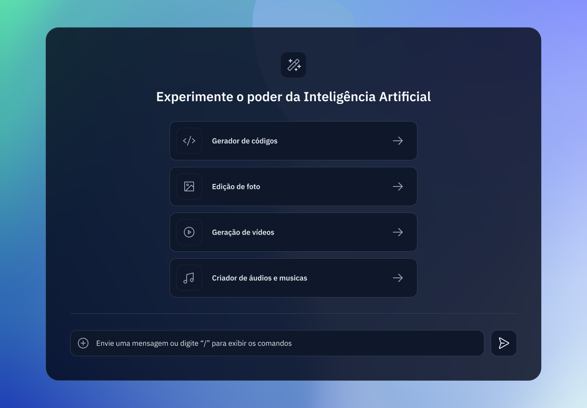

<h1 align="center"> Desafio #28 - uma plataforma de IA </h1>

<p align="center">
 <a href="https://www.rocketseat.com.br/boracodar">#boraCodar</a> são desafios propostos pela rocketseat para você apostar sua evolução em programação. <br/>
</p>

<p align="center">
  <a href="#-tecnologias">Tecnologias</a>&nbsp;&nbsp;&nbsp;|&nbsp;&nbsp;&nbsp;
  <a href="#-projeto">Projeto</a>&nbsp;&nbsp;&nbsp;|&nbsp;&nbsp;&nbsp;
  <a href="#-layout">Layout</a>&nbsp;&nbsp;&nbsp;|&nbsp;&nbsp;&nbsp;
  <a href="#memo-licença">Licença</a>&nbsp;&nbsp;&nbsp;|&nbsp;&nbsp;&nbsp;
  <a href="#computer-executando-o-projeto">Executando o projeto</a>
</p>

<p align="center">
  
</p>

<br>

<p align="center">
  
</p>

## 🚀 Tecnologias

Esse projeto foi desenvolvido com as seguintes tecnologias:

- Next.js
- TypeScript
- Tailwindcss

## 💻 Projeto

O desafio da vez foi desenvolver a tela de inicio de uma plataforma de inteligência artificial.

As tecnologias ficaram a critério de cada um.

## 🔖 Layout

Você pode visualizar o layout do projeto através <a href="https://www.figma.com/file/05JT6dVvQWgvYHoV8QOyyv/Plataforma-de-IA---Desafio-28-(Community)?type=design&node-id=0-1&mode=design&t=qGmf40YtQElmOD8l-0" target="_blank">DESSE LINK</a>. É necessário ter conta no <a href="https://figma.com" target="_blank">Figma</a> para acessá-lo.

## :memo: Licença

Esse projeto está sob a licença MIT.

## :computer: Executando o projeto

Faça o clone do repositório e navegue até a pasta do projeto.

```bash
git clone https://github.com/rodrigoyuri/boracodar-desafio28.git

cd boracodar-desafio28
```

Detro do projeto instale as dependecias e execute um dos comandos abaixo para dar start na aplicação:

```bash
# Instalação de dependecias
npm install
# or
yarn install
# or
pnpm install

# Execução do projeto
npm run dev
# or
yarn dev
# or
pnpm dev
```

Abre o link <a href="http://localhost:3000" target="_blank">http://localhost:3000</a> com seu nevegador para ver o resultado.

---

:wave: [Participe da comunidade da Rocketseat!](https://discord.gg/rocketseat)

